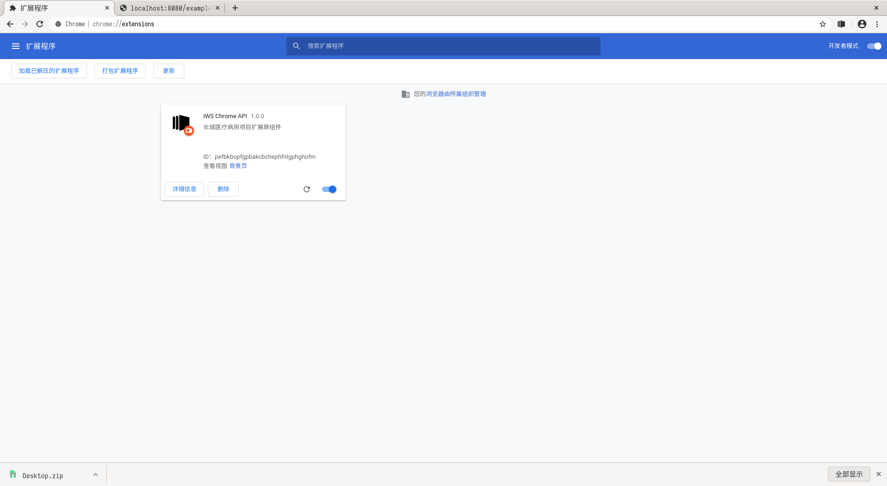

## Chrome/Chromium 浏览器投屏插件制作流程

### 环境配置

首先下载对应操作系统的 [chrome dev 版](https://www.chromium.org/getting-involved/dev-channel)并安装。

打开开发版浏览器，在浏览器窗口进入 chrome://extensions 配置。


将右上角的开发者模式启用。

### 项目构建

建立空白文件夹 iws-chrome-api ，添加项目说明文档 manifest.json , 一个内核脚本 background.js, 以及图标文件 icons 。

```
$ cd iws-chrome-api/
$ tree
.
├── background.js
├── icons
│   ├── icon.128.png
│   └── icon.48.png
└── manifest.json
```

有关 manifest.json 文档说明参考 [Manifest File Format](https://developer.chrome.com/extensions/manifest) ，此处给出样例

```
{
	"name": "IWS Chrome API",
	"version": "1.0.0",
	"manifest_version": 2,
	"description": "长城医疗病房项目扩展屏组件",
	"permissions": [ "tabs", "system.display" ], // 拥有 chrome.tabs, chrome.system.display 组件访问权限
	"icons":{ "48":"icons/icon.48.png", "128":"icons/icon.128.png" },
	"externally_connectable": {
		"matches": [ "http://localhost:8080/examples/*", "*://*.greatwall.com.cn/*" ] // 只有满足表达式的网站才可以与该插件通信
	},
	"background": {
		"persistent": false,
		"scripts": ["background.js"] // 内部脚本
	}
}
```

background.js 中写入消息监听处理逻辑：

```
function onMessageExternalFromWebPage(message, sender, callback) {
  switch (message.flag) {
    case 'GET_DISPLAY_INFO': { // 获取外设屏幕信息
      chrome.system.display.getInfo(callback);
      break;
    }
    case 'CREATE_WINDOW_TO_DISPLAY': { // 在外设屏幕创建窗口
      const { url, displayId } = message;
      chrome.system.display.getInfo(infos => {
        const info = infos.find(i => i.id === displayId); // 得到指定 ID 的 Display
        if (!info) return;
        const { left, top } = info.bounds;
        chrome.windows.create({ url, left, top, focused: false }, win => {
          chrome.windows.update(win.id, { state: 'fullscreen' });
          callback(win);
        });
      });
      break;
    }
    case 'CLOSE_WINDOW': { // 通过 ID 关闭窗口
      const { windowId } = message;
      chrome.windows.remove(windowId, () => {
        if (chrome.runtime.lastError) console.warn("Warning! but that's ok:", chrome.runtime.lastError);
      });
      break;
    }
    case 'MOVE_TAB_TO_DISPLAY': { // 将当前的 TAB 发送至指定 ID 的外设屏幕
      const { id: tabId, windowId } = sender.tab;
      const { displayId } = message;
      chrome.system.display.getInfo(infos => {
        const info = infos.find(i => i.id === displayId); // 得到指定 ID 的 Display
        if (!info) return;
        const { left, top } = info.bounds;
        chrome.windows.create({ tabId, left, top, focused: false }, win => {
          chrome.windows.update(win.id, { state: 'fullscreen' });
          callback({ ...win, tabId, sourceWindowId: windowId });
        });
      });
      break;
    }
    case 'MOVE_TAB_TO_WINDOW': { // 将指定的 TAB 页移动到指定的窗口
      const { id: tabId, windowId } = sender.tab;
      const { targetWindowId } = message;
      chrome.windows.update(windowId, { state: 'normal' }, () => {
        chrome.tabs.move(tabId, { windowId: targetWindowId, index: -1 });
      });
      break;
    }
    default:
      console.error('Error! cannot parse the message flag.');
      break;
  }
};

chrome.runtime.onMessageExternal.addListener(onMessageExternalFromWebPage)
```

接下来进行调试， chrome://extensions 下点击加载已解压的扩展程序，选择 iws-chrome-api 目录，可以看到插件已经被 chrome 加载，并且给出了一个 plugin id 。



我们接下来建立 web example 。

下载 apache tomcat 8.5.x 解压，删除 webapps 下的所有文件夹，创建 examples 文件夹，结构如下：

```
$ tree
.
└── examples
    ├── index.html
    └── WEB-INF
        └── web.xml
```

index.html 示例如下：

```
<!DOCTYPE html>
<html lang="zh-CN">
	<head>
		<meta name="viewport" content="width=device-width, initial-scale=1">
	</head>
	<body>
		<button onclick="getDisplayInfo()">Console Log Display Info</button>
		<button onclick="createWindowToDisplay()">Create Window To Display</button>
		<button onclick="closeWindow()">Close Window</button>
		<button onclick="moveTabToDisplay()">Move Tab To Display</button>
		<button onclick="moveTabToWindow()">Move Tab To Window</button>
	</body>
	<script type="text/javascript">
		const appid = 'pefbkbopfgpbakcbchephfnlgphghofm';
		let displayId, baiduWindowId, tempWindowId;
		function getDisplayInfo() {
			chrome.runtime.sendMessage(appid, { flag: 'GET_DISPLAY_INFO' }, function(response) { displayId = response[0].id; console.log(response); });
		}
		function createWindowToDisplay() {
			chrome.runtime.sendMessage(appid, { flag: 'CREATE_WINDOW_TO_DISPLAY', url: 'https://www.baidu.com', displayId }, win => { baiduWindowId = win.id; });
		}
		function closeWindow() {
			chrome.runtime.sendMessage(appid, { flag: 'CLOSE_WINDOW', windowId: baiduWindowId });
		}
		function moveTabToDisplay() {
			chrome.runtime.sendMessage(appid, { flag: 'MOVE_TAB_TO_DISPLAY', displayId }, win => { tempWindowId = win.sourceWindowId; });
		}
		function moveTabToWindow() {
			console.log(tempWindowId);
			chrome.runtime.sendMessage(appid, { flag: 'MOVE_TAB_TO_WINDOW', targetWindowId: tempWindowId });
		}
	</script>
</html>
```

web.xml 示例如下：

```
<?xml version="1.0" encoding="UTF-8"?>
<web-app xmlns="http://xmlns.jcp.org/xml/ns/javaee" xmlns:xsi="http://www.w3.org/2001/XMLSchema-instance" xsi:schemaLocation="http://xmlns.jcp.org/xml/ns/javaee http://xmlns.jcp.org/xml/ns/javaee/web-app_3_1.xsd" version="3.1" metadata-complete="true">
    <description>
      Chrome API Examples.
    </description>
    <display-name>Chrome API Examples</display-name>
    <welcome-file-list>
        <welcome-file>index.html</welcome-file>
    </welcome-file-list>
</web-app>
```

启动 tomcat 进入网址 http://localhost:8080/examples/ 即可看到测试页面：


前端开发人员也可以通过 nodejs & webpack server 进行调试。

依次点击按钮，即可实现屏幕发布的效果。

chrome://extensions 下点击打包扩展程序，选择 iws-chrome-api 目录，即可打包成插件的标准压缩文件 ctx ，将文件放置在目标机器，使用 chrome 打开即可进行插件安装。
